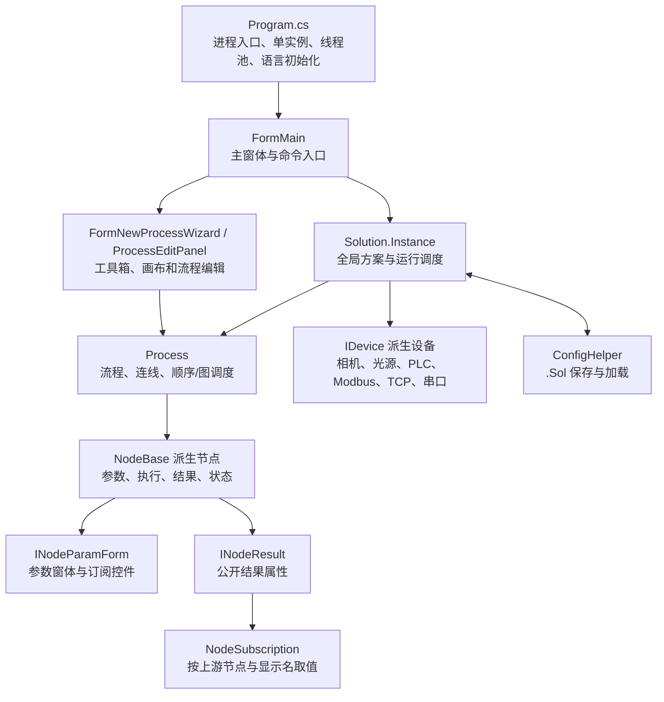

# TDJS-Vision 框架代码分布与新增节点开发交接文档

## 1. 文档说明

本文面向接手 TDJS-Vision 后续开发、节点扩展、问题排查和版本维护的开发人员，目标是回答以下问题：

1. 程序从哪里启动，各层代码分别放在哪里。
2. “方案—流程—节点”三层对象如何协作。
3. 节点怎样从工具箱进入画布、怎样保存、怎样加载、怎样运行和传递结果。
4. 新增一个节点时必须创建哪些文件、修改哪些注册点、做哪些兼容和测试。
5. 哪些位置是当前框架的特殊约束，漏改后会出现什么现象。

文档依据 2026 年 7 月 14 日工作区代码编写，基线提交为 `281d06b`。工作区当时存在其他未提交修改，因此本文只说明已核实的现有架构，不把未提交内容归为本次文档任务的代码改动。

## 2. 接手后先记住的十条结论

1. 这是一个 `.NET Framework 4.8`、C# 7.3、WinForms 的单工程应用，默认交付平台为 `x64`。
2. 核心业务模型是 `Solution → Process → NodeBase`，分别对应方案、流程和节点。
3. `Solution` 是线程安全懒加载单例，当前工程没有通用依赖注入容器。
4. 节点不是运行时扫描 DLL 得到的插件，而是编译期扩展：枚举、工厂、工具箱 XML 和 `.csproj` 都要注册。
5. 普通流程节点创建与组合模块节点创建使用两套映射：`ProcessEditPanel.CreateNode` 和 `NodeFactory.CreateNode`，新增节点必须同步维护。
6. 节点参数通过 `INodeParam` 多态保存，序列化依赖参数类完整类型名；移动命名空间或重命名参数类会影响旧 `.Sol` 文件。
7. 节点结果只有公开属性带 `[DisplayName("中文显示名")]` 时，才会出现在下游节点的订阅结果下拉框中。
8. 流程同时兼容旧的顺序执行和新的画布连线图执行；条件节点还要正确返回 `True/False` 分支。
9. 所有 WinForms 控件必须放在对应 `.Designer.cs` 中，控件 `Text` 使用简体中文；需要中英文切换时，新增字典项以中文文本为键。
10. 完成新增节点不能只看“能拖到画布”，至少要验证创建、参数保存、方案重载、单次运行、连线分支、复制粘贴、删除释放和旧方案兼容。

## 3. 技术基线与构建边界

| 项目项 | 当前值 | 说明 |
| --- | --- | --- |
| 解决方案 | `TDJS-Vision.sln` | Visual Studio 入口 |
| 工程 | `TDJS-Vision.csproj` | 旧式非 SDK 工程，源文件显式列入工程文件 |
| 输出类型 | `WinExe` | Windows 桌面程序 |
| 目标框架 | `.NET Framework 4.8` | 不可直接使用仅适用于现代 .NET 的 API |
| C# 版本 | `7.3` | 新代码不能使用更高语言版本语法 |
| 主要平台 | `x64` | 工业相机、OpenCV、AI 和原生算法库通常要求位数一致 |
| 包管理 | `packages.config` | NuGet 依赖位于 `packages` |
| 方案文件 | `*.Sol` | 实际为 JSON，多态参数保存类型全名 |
| 工具箱配置 | `ToolTreeView.xml` | 运行时从工作目录读取 |
| 多语言 | `Languages/zh-CN.json`、`Languages/en-US.json` | 新增键按项目要求使用中文键 |

关键外部依赖包括 OpenCvSharp、Newtonsoft.Json、SunnyUI、DockPanelSuite、HslCommunication、NModbus4、EPPlus、Roslyn 脚本运行库、TensorRT/OpenVINO 相关运行库，以及海康、Basler、华睿等设备 SDK。发布或换机时，除托管 DLL 外，还要检查 `Native`、`dll` 和输出目录下的设备/算法运行环境。

## 4. 总体架构



当前可识别的设计模式和扩展边界如下：

| 模式/边界 | 实现位置 | 作用 | 维护提示 |
| --- | --- | --- | --- |
| 单例 | `Solution.Instance` | 集中保存方案、流程、设备、节点和运行状态 | 业务代码高度依赖全局状态，测试时需主动清理 |
| 工厂 | `NodeFactory.CreateNode` | 组合模块按 `NodeType` 创建节点 | 普通流程另有重复工厂，必须同步 |
| 接口/策略 | `IDevice`、`ICamera`、`ILight`、`IPlc`、`IModbus`、`ITcpDevice` | 替换不同品牌设备实现 | 新品牌应优先新增接口实现，不把品牌判断散落到节点 |
| 观察者 | 多个静态事件、`ProcessEvents`、`NodeStatusChanged` | UI、流程和资源管理之间传递状态 | 释放窗体时要解除订阅，避免静态事件持有对象 |
| 适配器 | `IImageSaveJudgmentAdapter` 等 | 把不同结果转换为统一业务语义 | 新结果类型优先通过适配器接入，不继续扩大硬编码分支 |
| 多态序列化 | `PolyConverter`、`DeviceListConverter<T>` | 保存接口/抽象类型的具体实现 | 类型全名是兼容契约，不可随意重命名 |

## 5. 代码分布

### 5.1 根目录核心文件

| 路径 | 职责 | 修改时重点 |
| --- | --- | --- |
| `Program.cs` | 程序入口、单实例互斥、线程池最小线程数、语言初始化、主窗体启动、命令行 `.Sol` 加载 | 启动顺序、全局异常、重复启动、启动性能 |
| `FormMain.cs` / `.Designer.cs` | 主窗体、菜单/工具栏、DockPanel、方案打开保存、单次/循环运行、设备与训练窗体入口 | 新控件必须进入设计器文件；运行期不能阻塞 UI |
| `Solution.cs` | 方案单例、设备/流程/节点集合、流程组调度、取消、加载保存、资源释放 | 多线程、取消令牌、设备回调、资源生命周期 |
| `Process.cs` | 流程属性、节点列表、连线表、顺序执行、图执行、条件分支、并行批次、运行统计 | 新节点的停止/分支语义、并行安全、当前批次结果 |
| `ConfigHelper.cs` | `.Sol` 配置 DTO、保存、加载、多态转换器、设备恢复事件链 | 参数类型全名、旧方案默认值、加载顺序 |
| `SharedVariable.cs` | 线程安全共享变量 | 新共享类型的并发读写和序列化 |
| `ProcessCompletionTracker.cs` | 流程完成状态跟踪 | 被动流程、等待流程节点 |
| `LanguageManager.cs` | 语言加载、控件/菜单绑定、运行时切换 | 新增中英文键值必须在两份 JSON 同步 |
| `ToolTreeView.xml` | 工具箱分类、中文名称、图标键、`NodeType` 标签 | `Tag` 必须与枚举名称完全一致 |
| `TDJS-Vision.csproj` | 编译文件、资源、原生库和内容文件清单 | 旧式项目不会自动编译新 `.cs` 文件 |

### 5.2 `Node` 节点框架

| 路径 | 职责 |
| --- | --- |
| `Node/INode.cs` | `INodeParamForm`、`INodeParam`、`INodeResult`、`NodeReturn`、`NodeStatus`、`NodeRunFlag`、`NodeType` 等公共契约 |
| `Node/NodeBase.cs` / `.Designer.cs` | 节点公共 UI、状态、耗时、启停、重命名、备注、删除、参数窗体打开和部分资源释放 |
| `Node/NodeFactory.cs` | 组合模块运行时的节点创建映射 |
| `Node/NodeSubscription.cs` / `.Designer.cs` | 上游节点选择、结果属性选择、当前运行批次校验和类型转换 |
| `Node/DynamicResultVariable.cs` | 动态结果变量解析 |
| `Node/<分类>/<节点>/` | 每个具体节点的执行、参数、结果、参数窗体、设计器和可选算法服务 |

### 5.3 `Forms` 界面层

| 目录 | 主要职责 |
| --- | --- |
| `Forms/ProcessNew` | 流程管理、工具箱、自由画布、连线、节点创建、复制粘贴、撤销重做和流程运行 |
| `Forms/ImageViewer`、`Forms/ResultView`、`Forms/Logger` | 图像、结果和日志展示 |
| `Forms/CameraAdd`、`LightAdd`、`PLCAdd`、`ModbusAdd`、`TCPAdd`、`COMAdd` | 设备配置与方案恢复 |
| `Forms/ShapeDraw` | ROI 数据结构、绘制和编辑 |
| `Forms/AiTrainForm` | AI、无监督和大模型训练界面/服务 |
| `Forms/GlobalSignalSettings`、`DetectItemManager`、`SystemSetting`、`SolRunParam` | 全局信号、检测项、系统和运行参数 |
| `Forms/YTMessageBox` | 项目统一消息框 |

`Forms/ProcessNew` 是新增节点最关键的 UI 链路：

- `FormNewProcessWizard.Init()` 从 `ToolTreeView.xml` 反序列化工具箱。
- 工具项拖动时生成 `DragData(Text, NodeType)`。
- `ProcessEditPanel.NodeEditPanel_DragDrop()` 接收拖拽。
- `ProcessEditPanel.CreateNode()` 创建节点并加入全局方案、当前流程和画布。
- `ProcessFlowCanvas` 负责位置、尺寸、连线、选择、删除、复制粘贴、撤销重做和运行状态绘制。

### 5.4 `Device` 设备层

| 目录/接口 | 现有实现方向 |
| --- | --- |
| `Device/IDevice.cs` | 所有设备的基础接口与品牌枚举 |
| `Device/Camera/ICamera.cs` | 二维相机；现有海康等实现 |
| `Device/3D/I3DCamera.cs` | 三维相机 |
| `Device/Light/ILight.cs` | 光源；PPX、Rsee、TDJS 等实现 |
| `Device/PLC/IPlc.cs` | PLC；三菱、松下等实现 |
| `Device/Modbus/IModbus.cs` | Modbus RTU/TCP 主从设备 |
| `Device/TCP/ITcp.cs` | TCP 客户端/服务器 |
| `Device/COM/ComDevice.cs` | 串口设备 |

新设备优先实现已有接口并由设备管理窗体负责创建和保存；节点只消费接口，不应直接依赖某一品牌类，除非该能力确实只属于该品牌。

### 5.5 资源、配置、测试与交付文件

| 路径 | 说明 |
| --- | --- |
| `Languages` | 中英文语言包 |
| `Icon`、`Resources` | 工具箱、菜单、窗体和业务图片资源 |
| `dll`、`Native` | 托管设备 SDK 和本机算法 DLL |
| `Tests/*.Tests.ps1` | 当前主要回归测试，很多测试直接检查源码约束和关键行为 |
| `Diagnostics` | 性能和运行诊断辅助代码 |
| `docs` | 设计、实施计划、说明书素材和本交接文档 |
| `outputs` | 生成的交付文档，不是业务源码 |

## 6. 节点分类与当前分布

### 6.1 目录中的实现分类

| 分类目录 | 子模块 |
| --- | --- |
| `1-Acquisition` | `ImageSource`、`ImageSource3D`、`ImageShow`、`ImageShow3D` |
| `2-ImagePreprocessing` | `ImageCrop`、`ImagePreprocess`、`ImageRotate`、`ImageSplit` |
| `3-Detection` | `TDAI`、`Unsupervised`、`LargeModel`、`FindLine`、`FindCircle`、`MatchTemplate`、`QRScan`、`BatteryEar`、`ColorDiscern`、`BinaryAnalysis` |
| `4-Measurement` | 卡尺找线/圆/椭圆、找点、位置修正、线线角度、点点/点线/点区域距离及公共测量类型 |
| `5-EquipmentCommunication` | 光源、相机 IO、串口、PLC、Modbus、TCP、全局信号、科锐 IO 等 |
| `6-LogicTool` | 条件、流程触发、流程信号、等待流程、If/Else/EndIf、多条件、共享变量、四则运算、组合模块、C# 脚本、延时、弹窗 |
| `7-ResultProcessing` | 结果绘制、ROI 绘制、汇总、显示、保存、删除和 Excel 导出 |
| `8-GeometryCreation` | 线组合拟合 |

### 6.2 注册一致性审计结果

2026 年 7 月 14 日按源码自动比对得到：

| 项目 | 数量 |
| --- | ---: |
| `NodeType` 枚举值（含 `UNKNOWN`） | 73 |
| 工具箱可拖拽叶节点 | 64 |
| `NodeFactory` 已映射类型 | 67 |
| `ProcessEditPanel` 已映射类型 | 67 |

两套创建映射当前完全一致。以下枚举不在工具箱中：

- `UNKNOWN`：占位值。
- `CameraShot`、`LocalPicture`、`GrayScale`、`BlobAnalysis`、`TemplateMatch`：历史保留或未完成类型，当前两套工厂都没有映射。
- `ImageShow3D`：已有实现和工厂映射，但工具箱当前未展示。
- `Else`、`EndIf`：已有实现和工厂映射，主要用于旧顺序 If 逻辑兼容，当前工具箱未展示。

新增节点后应重新执行同类审计，确保不是只增加了枚举或只增加了工具箱项。

## 7. 程序启动、方案加载与运行链路

### 7.1 启动链路

```text
Program.Main
  → 命名 Mutex 保证同一桌面会话单实例
  → RunApplication
  → 调整 ThreadPool 最小工作线程/IO 线程
  → 初始化日志、编码、语言和第三方授权
  → 创建 FormMain
  → 如命令行传入 .Sol，则加载指定方案
  → Application.Run(FormMain)
```

主窗体加载后会初始化 DockPanel、菜单语言、设备管理和流程管理窗口；如果系统设置允许自动加载，则读取上一次方案并可继续自动运行。

### 7.2 方案加载链路

```text
Solution.Load
  → ConfigHelper.SolLoad
  → 读取 .Sol JSON
  → 反序列化 SolConfig
  → Solution.SolReset 释放旧设备、节点和窗体资源
  → 恢复方案基础字段
  → DeserializationCompletionEvent
  → 按设备依赖顺序恢复光源、相机、PLC、Modbus、TCP、串口
  → 流程管理窗口恢复 Process、NodeParam、画布位置和连接
```

设备先恢复、流程后恢复是必要顺序，因为相机取图、PLC、光源等节点参数会引用设备配置。

### 7.3 方案级运行链路

`Solution.Run()` 按流程 `Group` 分组并行，同组内按 `RunLv` 分层执行；同优先级主动流程可以并行，被动流程由流程触发节点或相机回调触发。停止运行通过 `Solution.Instance.CancellationToken` 传播到流程和节点。

### 7.4 流程级运行链路

`Process` 支持两套执行模式：

1. 存在画布连线或起始节点时，进入图执行模式。
2. 没有图结构的旧方案继续按 `Process.Nodes` 顺序执行。

图执行又分为顺序图调度和并行图调度。调度器根据入边完成情况、订阅依赖、节点返回值和失败状态选择下一批节点。条件节点返回 `ProcessConnectionBranch.True` 或 `False`；普通节点通常返回默认分支。

节点的统一运行协议是：

```csharp
public override Task<NodeReturn> Run(CancellationToken token, bool showLog)
```

返回值含义：

| 字段 | 含义 |
| --- | --- |
| `Flag = ContinueRun` | 正常继续 |
| `Flag = StopRun` | 停止整个后续流程 |
| `Flag = StopBranch` | 图模式只停止当前分支；旧顺序模式按提前结束处理 |
| `NextIndex >= 0` | 旧顺序模式跳转到指定索引 |
| `NextBranch = True/False` | 图模式选择条件分支 |

## 8. 节点内部契约

### 8.1 标准文件组成

一个有参数界面的标准节点通常包含：

```text
Node/<分类>/<节点名>/
├── Node示例.cs
├── NodeParam示例.cs
├── NodeResult示例.cs
├── NodeParamForm示例.cs
├── NodeParamForm示例.Designer.cs
└── NodeParamForm示例.resx
```

复杂节点可以继续拆出算法接口、运行服务、结果适配器、资源句柄管理器和纯算法测试类。不要把大段算法、设备协议或文件 IO 全部写进窗体事件。

### 8.2 `NodeBase` 提供的能力

- 节点 ID、名称、类型、所属流程。
- `Active`、`OutputLog`、选择状态、起始节点标记。
- 画布位置和尺寸。
- 参数窗体 `ParamForm` 与运行结果 `Result`。
- 运行状态、耗时、NG 状态和当前 `RunId` 成功标记。
- 双击打开参数窗体。
- 右键启用、禁用、重命名、备注、删除和日志控制。
- 删除时从 `Solution.Nodes`、`Process.Nodes` 移除，并触发画布清理。

### 8.3 参数契约

参数类实现空标记接口 `INodeParam`。为了正确保存与恢复：

- 需要保存的数据必须是公开字段或公开可读写属性。
- 订阅通常保存上游节点文本 `Text1` 和结果显示名 `Text2`。
- 不要把 `Mat`、窗体、设备连接、线程、Task、CancellationToken、原生句柄等运行时对象直接保存到参数中。
- 运行时缓存可标记 `[JsonIgnore]`，或由节点/独立运行服务管理。
- 新参数应给出向后兼容默认值，旧 `.Sol` 没有该字段时仍能运行或给出明确提示。
- 参数类完整类型名被 `PolyConverter` 写入 `.Sol`，重命名类/命名空间前必须设计迁移。

### 8.4 参数窗体契约

参数窗体一般继承 `FormBase` 并实现 `INodeParamForm`：

- `Params`：当前已保存参数。
- `SetNodeBelong(NodeBase node)`：初始化订阅控件所属节点。
- `SetParam2Form()`：方案加载或复制粘贴后，把反序列化参数恢复到控件。
- 确定按钮：读取控件，构造新的参数对象赋给 `Params`，再隐藏窗体。
- 刷新/预览：使用 `Process.RunForUpdateImages(currentNode)` 只运行必要上游节点。

WinForms 强制规则：

1. 控件声明、创建、尺寸、位置、锚定、事件绑定和 `Controls.Add` 必须写在 `.Designer.cs`。
2. 业务事件处理、校验和参数转换写在普通 `.cs`。
3. 所有控件 `Text` 默认使用简体中文。
4. 需要中英文切换时，在 `zh-CN.json` 和 `en-US.json` 中使用相同的中文键，再用 `LanguageManager` 绑定。
5. 图片、Mat、计时器、设备订阅和后台任务要在 `Dispose` 或窗体关闭时释放。

### 8.5 结果与订阅契约

结果类实现 `INodeResult`，至少提供：

```csharp
public int RunTime { get; set; }
```

供下游订阅的属性必须声明输出契约并使用中文显示名：

```csharp
[SubscriptionOutput]
[DisplayName("处理后图像")]
public OutputImage OutputImage { get; set; }
```

`NodeSubscription` 的行为：

1. 只列出当前节点在图结构中的上游节点，按反向连线距离由近到远排列。
2. 新订阅从最近上游开始，按输入契约寻找兼容输出；不匹配时继续向前查找。同层按节点编号稳定排序。
3. 通过统一端口目录发现和缓存静态及动态输出，按类型、集合形态和可见性筛选。输入须在 `Init` 前声明契约。
4. 运行期通过 `GetValue<T>()` 取值并检查类型。
5. 当前流程正在运行时，上游必须在本轮 `CurrentRunId` 成功执行，否则拒绝读取旧结果。

因此更改 `[DisplayName]` 会影响旧方案中保存的 `Text2`。如确需改名，应在 `SetParam2Form` 或订阅恢复逻辑中提供旧名称迁移。

新增节点统一遵循[节点自动订阅规则](节点自动订阅规则.md)。图像源→图像裁切→卡尺默认订阅裁切输出；位置修正和其他类型使用相同查找策略。空参数恢复不能清除自动选择，使用运行参数快照的节点必须在 `SelectionChanged` 时同步订阅。

### 8.6 资源所有权

必须在设计节点时明确“谁创建、谁释放”：

- 透传上游 `Mat` 时不能随意 `Dispose` 上游对象。
- 新建的临时 `Mat`、Bitmap、Stream、文件句柄必须及时释放。
- 长寿命模型句柄放在节点运行服务中缓存，节点删除、流程删除、方案重置和程序退出均要释放。
- 静态事件订阅必须在控件/节点释放时解除。
- 后台生产者与消费者要有容量上限、取消机制和异常观察，避免无限队列。

## 9. 新增节点完整流程

以下流程以新增 `ExampleProcess` 类型的“示例处理”节点为说明名称。实际开发时应使用能表达业务含义的英文类型名和简体中文显示名。

### 步骤 0：先确定节点契约

编码前写清楚：

- 节点属于采集、处理、检测、测量、通信、逻辑、结果还是图形创建。
- 输入来自哪个结果类型，例如 `OutputImage`、`AlgorithmResult`、数值、字符串或设备接口。
- 输出的具体类型、中文显示名和 OK/NG 语义。
- 是否允许并行执行，是否读写共享状态或独占设备。
- 参数哪些需要持久化，哪些只是运行缓存。
- 取消、超时、重试和异常策略。
- 运行时资源的创建和释放位置。
- 性能预算：是否在每次运行重复加载模型、创建大对象、Bitmap/Mat 往返转换或同步写磁盘。

### 步骤 1：建立目录和文件

例如图像处理节点放到：

```text
Node/2-ImagePreprocessing/ExampleProcess/
```

创建：

```text
NodeExampleProcess.cs
NodeParamExampleProcess.cs
NodeResultExampleProcess.cs
NodeParamFormExampleProcess.cs
NodeParamFormExampleProcess.Designer.cs
NodeParamFormExampleProcess.resx
```

优先复制同分类、同输入输出类型的现有节点作为参考。例如图像输入输出节点可参考 `ImageRotate`，AI 结果节点可参考 `Unsupervised` 或 `LargeModel`，条件分支可参考 `If`/`MultiCondition`。

### 步骤 2：增加 `NodeType`

在 `Node/INode.cs` 的 `NodeType` 末尾追加，并添加中文 XML 注释：

```csharp
/// <summary>
/// 示例处理。
/// </summary>
ExampleProcess,
```

`NodeConfig.NodeType` 使用 `StringEnumConverter`，方案保存的是名称而不是整数。仍建议只追加、不复用旧名称，便于审计和兼容。

### 步骤 3：实现参数类

```csharp
namespace TDJS_Vision.Node._2_ImagePreprocessing.ExampleProcess
{
    /// <summary>
    /// 示例处理节点的持久化参数。
    /// </summary>
    public sealed class NodeParamExampleProcess : INodeParam
    {
        /// <summary>
        /// 上游节点的“编号.名称”。
        /// </summary>
        public string Text1 { get; set; }

        /// <summary>
        /// 上游结果属性的中文显示名。
        /// </summary>
        public string Text2 { get; set; }

        /// <summary>
        /// 示例阈值。
        /// </summary>
        public double Threshold { get; set; } = 1.0;
    }
}
```

参数校验要同时存在于参数窗体保存时和节点运行前；不能只依赖 UI，因为旧方案、复制粘贴或手工编辑配置都可能绕过 UI。

### 步骤 4：实现结果类

```csharp
using System.ComponentModel;
using TDJS_Vision.Node._1_Acquisition.ImageSource;

namespace TDJS_Vision.Node._2_ImagePreprocessing.ExampleProcess
{
    /// <summary>
    /// 示例处理节点的运行结果。
    /// </summary>
    public sealed class NodeResultExampleProcess : INodeResult
    {
        /// <summary>
        /// 本次节点运行耗时，单位为毫秒。
        /// </summary>
        public int RunTime { get; set; }

        /// <summary>
        /// 处理后的图像，供下游节点订阅。
        /// </summary>
        [SubscriptionOutput]
        [DisplayName("处理后图像")]
        public OutputImage OutputImage { get; set; } = new OutputImage();
    }
}
```

如果结果代表业务判定，可按现有框架实现 `IJudgmentResult`；如果要让保存图片等模块识别新的判定结构，优先新增适配器。

### 步骤 5：实现参数窗体及设计器

普通 `.cs` 负责参数逻辑：

```csharp
public partial class NodeParamFormExampleProcess : FormBase, INodeParamForm
{
    /// <summary>
    /// 当前节点保存的参数。
    /// </summary>
    public INodeParam Params { get; set; }

    /// <summary>
    /// 初始化上游订阅。
    /// </summary>
    public void SetNodeBelong(NodeBase node)
    {
        nodeSubscription1.SetExpectedValueType<OutputImage>();
        nodeSubscription1.Init(node);
    }

    /// <summary>
    /// 将反序列化参数恢复到窗体控件。
    /// </summary>
    public void SetParam2Form()
    {
        if (!(Params is NodeParamExampleProcess param))
            return;

        nodeSubscription1.SetText(param.Text1, param.Text2);
        numericUpDownThreshold.Value = (decimal)param.Threshold;
        Hide();
    }
}
```

在 `.Designer.cs` 中创建 `NodeSubscription`、中文标签、数值控件和“确定”“取消”“刷新”等按钮，设置布局并加入窗体 `Controls`。不要在普通 `.cs` 的构造函数里临时创建控件，否则 Visual Studio 设计器不可见。

### 步骤 6：实现节点执行类

```csharp
public sealed class NodeExampleProcess : NodeBase
{
    /// <summary>
    /// 初始化节点、参数窗体和空结果。
    /// </summary>
    public NodeExampleProcess(int nodeId, string nodeName, Process process, NodeType nodeType)
        : base(nodeId, nodeName, process, nodeType)
    {
        ParamForm = new NodeParamFormExampleProcess();
        ParamForm.SetNodeBelong(this);
        Result = new NodeResultExampleProcess();
    }

    /// <summary>
    /// 执行一次示例处理。
    /// </summary>
    public override async Task<NodeReturn> Run(CancellationToken token, bool showLog)
    {
        Stopwatch stopwatch = Stopwatch.StartNew();
        SetStatus(NodeStatus.Running, "*");

        try
        {
            await CheckTokenCancel(token);

            NodeParamExampleProcess param = ParamForm.Params as NodeParamExampleProcess;
            if (param == null)
                throw new InvalidOperationException($"节点({ID}.{NodeName})运行参数未设置或保存！");

            NodeParamFormExampleProcess form = ParamForm as NodeParamFormExampleProcess;
            if (form == null)
                throw new InvalidOperationException($"节点({ID}.{NodeName})参数窗体类型错误！");

            // 读取订阅、执行算法并构造本轮新结果。
            NodeResultExampleProcess result = new NodeResultExampleProcess();

            result.RunTime = SetRunResult(stopwatch, NodeStatus.Successful);
            Result = result;

            if (showLog)
                LogHelper.AddLog(MsgLevel.Info, $"节点({ID}.{NodeName})运行成功！({result.RunTime} ms)", true);

            return new NodeReturn(NodeRunFlag.ContinueRun);
        }
        catch (OperationCanceledException)
        {
            SetRunResult(stopwatch, NodeStatus.Unexecuted);
            throw;
        }
        catch (Exception ex)
        {
            SetRunResult(stopwatch, NodeStatus.Failed);
            LogHelper.AddLog(MsgLevel.Fatal, $"节点({ID}.{NodeName})运行失败！原因：{ex.Message}", true);
            throw new InvalidOperationException($"节点({ID}.{NodeName})运行失败，原因：{ex.Message}", ex);
        }
    }
}
```

实际代码还要遵守：

- 计算密集型代码不要为了形式而 `Task.Run`；流程层已经负责并发调度。
- 长循环和阻塞等待中定期检查取消令牌。
- 每次运行构造本轮新结果，避免失败后下游误读旧数据。
- `showLog == false` 时避免拼接大段诊断字符串；高频日志使用惰性诊断接口。
- 异常用 `throw;` 保留堆栈，包装时保留 `InnerException`，禁止 `throw ex;`。
- 不在 UI 线程同步等待异步任务。

### 步骤 7：注册普通流程创建映射

在 `Forms/ProcessNew/ProcessEditPanel.cs`：

1. 添加节点命名空间 `using`。
2. 在 `CreateNode(NodeType, ...)` 的 `switch` 中增加：

```csharp
case NodeType.ExampleProcess:
    node = new NodeExampleProcess(nodeId, nodeName, _process, nodeType);
    break;
```

该入口覆盖工具箱拖入、方案恢复和复制粘贴。漏改时通常报“节点创建失败”，或加载方案时节点缺失。

### 步骤 8：注册组合模块工厂

在 `Node/NodeFactory.cs`：

1. 添加节点命名空间 `using`。
2. 在 `CreateNode(...)` 中增加：

```csharp
case NodeType.ExampleProcess:
    return new NodeExampleProcess(nodeId, nodeName, process, nodeType);
```

该入口当前由 `CompositeModule` 内部恢复节点使用。漏改后普通流程可能正常，但组合模块加载或运行失败。

长期优化建议是让 `ProcessEditPanel` 也调用 `NodeFactory`，只保留一个映射源；在完成重构和回归测试前，新增节点仍必须同步两处。

### 步骤 9：加入工具箱

在 `ToolTreeView.xml` 的正确分类中增加：

```xml
<Node Text="示例处理"
      ImageName="图像处理"
      Tag="ExampleProcess"
      SelectedImageName="图像处理" />
```

约束：

- `Text` 必须为简体中文。
- `Tag` 必须与 `NodeType.ExampleProcess` 名称完全一致，区分大小写。
- `ImageName` 必须是工具箱 `ImageList` 中已有的键，或先在设计器资源中增加图标。
- `ToolTreeView.xml` 必须以 UTF-8 保存，并随输出复制；运行时按相对路径读取。

### 步骤 10：加入 `.csproj`

旧式工程需要显式增加：

```xml
<Compile Include="Node\2-ImagePreprocessing\ExampleProcess\NodeExampleProcess.cs">
  <SubType>UserControl</SubType>
</Compile>
<Compile Include="Node\2-ImagePreprocessing\ExampleProcess\NodeParamExampleProcess.cs" />
<Compile Include="Node\2-ImagePreprocessing\ExampleProcess\NodeResultExampleProcess.cs" />
<Compile Include="Node\2-ImagePreprocessing\ExampleProcess\NodeParamFormExampleProcess.cs">
  <SubType>Form</SubType>
</Compile>
<Compile Include="Node\2-ImagePreprocessing\ExampleProcess\NodeParamFormExampleProcess.Designer.cs">
  <DependentUpon>NodeParamFormExampleProcess.cs</DependentUpon>
</Compile>
<EmbeddedResource Include="Node\2-ImagePreprocessing\ExampleProcess\NodeParamFormExampleProcess.resx">
  <DependentUpon>NodeParamFormExampleProcess.cs</DependentUpon>
</EmbeddedResource>
```

如果增加模型、模板、脚本或本机 DLL，还要根据是否需要复制到输出目录配置 `Content`/`None` 和 `CopyToOutputDirectory`。

### 步骤 11：检查按类型硬编码的集成点

全仓搜索：

```powershell
rg -n "NodeType\." --glob "*.cs" --glob "!bin/**" --glob "!obj/**"
```

重点判断新节点是否需要接入：

- `ConditionRun`：结果能否直接作为条件。
- `MultiCondition`：是否可通过反射读取，是否应实现 `IJudgmentResult`。
- `ResultSummarize`：是否要汇总新的 `AlgorithmResult`。
- `ImageSave`：是否要解释新的 OK/NG 结果或绘制结果。
- `NodeBase`：是否要显示业务 NG；删除时是否要释放特殊资源。
- `ProcessFlowCanvas.GetNodeBandColor`：是否需要指定分类颜色；未指定会使用默认色，不影响运行。
- `If`/`MessageBox`/`ProcessTrigger`：是否对来源节点类型有特殊判断。

优先通过接口和适配器扩展，不要继续堆叠只识别具体节点类型的 `switch`。

### 步骤 12：处理多语言

若参数窗体需要运行时中英文切换：

```json
// zh-CN.json
"示例处理.阈值": "阈值"

// en-US.json
"示例处理.阈值": "Threshold"
```

设计器中 `Text` 仍填写中文默认值，再在窗体初始化时绑定中文键。不要只改一份语言文件，也不要把英文标识作为新增键。

### 步骤 13：增加测试

至少覆盖：

1. `NodeType`、两套工厂和工具箱 `Tag` 同时存在。
2. 新文件全部列入 `.csproj`，Designer/Resx 的 `DependentUpon` 正确。
3. 默认参数、边界值和非法值。
4. 正常运行产生本轮新结果，`RunTime` 被写入。
5. 取消时抛出 `OperationCanceledException` 且状态不是成功。
6. 异常时状态为失败，日志是简体中文且保留原异常。
7. `[DisplayName]` 结果能被下游订阅，类型错误给出清晰提示。
8. 保存 `.Sol` 后重载，参数、节点名称、位置、连线和订阅恢复。
9. 复制粘贴节点后参数是深拷贝，订阅能按新拓扑恢复。
10. 删除节点、删除流程、切换方案和关闭程序后资源全部释放。
11. 顺序模式和图模式都符合预期；条件节点还要测试 True/False/Default 分支。
12. 若允许图并行，多个实例同时运行不共享可变临时状态。

### 步骤 14：更新任务记录和文档

每次代码修改都要在任务文件中记录：

- 任务目标。
- 修改文件。
- 接口/设计模式选择。
- 性能和资源处理。
- 兼容性影响。
- 测试命令与结果。
- 未解决风险。

如果新增节点改变用户可见能力，还要同步 `README.md`、本交接文档的节点分布和用户说明书。

## 10. 新节点验证门禁

### 10.1 静态检查

```powershell
rg -n "ExampleProcess" Node Forms ToolTreeView.xml TDJS-Vision.csproj Tests
git diff --check
```

预期：枚举、普通工厂、组合模块工厂、工具箱和工程文件均能检索到；`git diff --check` 无输出并返回 0。

### 10.2 构建

```powershell
& "C:\Program Files\Microsoft Visual Studio\2022\Community\MSBuild\Current\Bin\MSBuild.exe" `
  "D:\MyCode\PublicWook\TDJS-Vision\TDJS-Vision.sln" `
  /t:Build /p:RestorePackages=false /m
```

预期：0 个错误。既有警告需与基线对比，新节点不能增加未解释警告。

### 10.3 UI 冒烟

1. 启动程序，确认工具箱中文名称和图标正常。
2. 拖到空流程，确认节点出现在鼠标释放位置。
3. 双击节点，确认所有控件在设计器中可见、中文显示、缩放不截断。
4. 保存参数后关闭再打开，确认控件值不丢失。
5. 与合法上游连线，确认订阅只显示上游和可订阅结果。
6. 执行一次，确认状态、耗时、日志和输出正确。
7. 保存方案、关闭软件、重新打开，确认完整恢复。
8. 复制粘贴、撤销、重做、删除节点，确认连线和资源无残留。
9. 将节点放入组合模块，确认内部保存、加载和执行。

### 10.4 性能验证

- Release|x64 下测量，不以调试器附加时的单次耗时作结论。
- 分开记录订阅读取、预处理、核心算法、结果构造、绘制、日志和 IO 耗时。
- 连续运行至少覆盖冷启动和稳定态，观察内存、句柄、GDI 对象和线程数量。
- 图像节点避免不必要的 `Mat → Bitmap → Mat`。
- 模型和设备连接复用长寿命句柄，不能每帧加载/打开。
- 文件保存使用有界异步队列，队列满时必须有明确策略。

## 11. 常见故障定位

| 现象 | 首查位置 | 常见原因 |
| --- | --- | --- |
| 工具箱没有新节点 | `ToolTreeView.xml`、输出目录 | XML 未复制、`Tag` 错误、XML 编码或反序列化失败 |
| 能看到但拖入失败 | `ProcessEditPanel.CreateNode` | 未添加 `case`、命名空间缺失、构造函数异常 |
| 普通流程正常，组合模块失败 | `NodeFactory.CreateNode` | 第二套工厂漏注册 |
| 编译器找不到新类 | `.csproj` | 新 `.cs` 未添加 `<Compile Include>` |
| 设计器打不开/控件不可见 | `.Designer.cs`、`.resx`、`DependentUpon` | 控件写在普通 `.cs`，或项目嵌套关系错误 |
| 参数保存后重启丢失 | `NodeParam`、确定按钮、`SetParam2Form` | 参数没赋给 `Params`、字段非公开、恢复逻辑漏写 |
| 旧方案加载后参数为 null | `PolyConverter` 日志 | 参数类型完整名称变化、类型不在程序集、JSON 结构不兼容 |
| 下游看不到结果 | `NodeResult` | 结果属性没有 `[DisplayName]` 或 `Result` 未初始化 |
| 下游读到上次结果 | 节点 `Run`、`CurrentRunId` | 本轮没生成新结果、节点失败后仍保留旧成功标记 |
| 条件线不按 True/False 运行 | `NodeReturn.NextBranch`、连线锚点 | 条件节点只返回默认分支，或 Right/Bottom 锚点语义错误 |
| 节点显示成功但业务结果为 NG | `IJudgmentResult`、`NodeBase.ApplyResultOutcomeStatus` | 运行成功与业务判定是不同维度，需要接入 NG 识别 |
| 停止按钮反应慢 | 节点长循环/阻塞 IO | 没有检查取消令牌，设备 API 没有超时 |
| 切方案后内存持续增长 | 节点删除和 `SolReset` | Mat/Bitmap/模型/设备/静态事件没有释放 |
| 中文乱码 | 源文件、XML、JSON 编码 | 文件不是 UTF-8 或读写没有指定正确编码 |

## 12. 当前架构风险与后续优化建议

以下是交接建议，不代表本次已经实施：

1. 合并两套节点创建映射：让普通流程和组合模块统一依赖 `INodeFactory`，避免重复 `switch`。
2. 建立节点描述符注册表：同时提供 `NodeType`、中文名称、分类、图标、工厂委托、输入输出契约和资源策略，再由注册表生成工具箱。
3. 把具体算法从参数窗体移到接口化服务，参数窗体只负责编辑和预览，便于无 UI 测试和替换实现。
4. 给资源型节点增加统一生命周期接口，例如 `INodeRuntimeResource`，由删除流程和方案重置统一释放。
5. 对旧 `.Sol` 建立显式版本迁移器，减少类型重命名、显示名变更和参数新增造成的隐式兼容风险。
6. 对高频图像链路建立统一所有权约定和性能基准，避免 Mat 重复复制、重复灰度转换和 GDI 泄漏。
7. 将源码文本断言测试逐步补充为可运行的单元/集成测试，特别是方案保存加载、图调度、取消和资源释放。
8. 逐步减少 `Solution.Instance` 的直接访问，以构造函数接口注入设备、日志、时钟、文件系统和算法服务，提高可测试性。

## 13. 开发提交前检查表

### 结构与注册

- [ ] `NodeType` 已追加并有中文注释。
- [ ] 参数、结果、节点、参数窗体、Designer 和 Resx 齐全。
- [ ] 普通流程 `ProcessEditPanel.CreateNode` 已注册。
- [ ] 组合模块 `NodeFactory.CreateNode` 已注册。
- [ ] `ToolTreeView.xml` 已加入中文节点，`Tag` 与枚举完全一致。
- [ ] `.csproj` 已包含全部代码、设计器和资源。

### 行为与兼容

- [ ] 参数可保存、恢复、复制和兼容旧方案。
- [ ] 结果属性有中文 `DisplayName`，下游能正确订阅。
- [ ] 顺序、图、并行和条件分支语义已按适用范围验证。
- [ ] 取消、失败、禁用、日志开关和运行耗时正确。
- [ ] 新业务结果已检查条件、汇总、存图、NG 显示等适配点。

### UI、性能与安全

- [ ] 所有控件都在 `.Designer.cs`，默认文本为简体中文。
- [ ] 中英文键值已在两份语言文件同步，键为中文。
- [ ] 没有每帧加载模型、打开设备、重复大对象转换或无界队列。
- [ ] 文件路径、脚本、网络数据和设备输入经过校验。
- [ ] 日志不输出密码、密钥、令牌或不必要的产品敏感数据。
- [ ] 删除节点、删除流程、切换方案和退出软件均能释放资源。

### 交付

- [ ] 新增测试通过。
- [ ] 相关既有回归测试通过。
- [ ] `Debug|x64` 和发布前的 `Release|x64` 构建通过。
- [ ] `git diff --check` 通过。
- [ ] 任务文件已记录修改、验证和遗留风险。
- [ ] README、交接文档和用户说明按影响范围同步。

## 14. 推荐阅读顺序

新接手人员建议依次阅读：

1. `README.md`：先建立产品和技术栈概念。
2. 本文：掌握代码分布和扩展流程。
3. `Program.cs`、`FormMain.cs`：理解启动和用户操作入口。
4. `Solution.cs`、`Process.cs`：理解方案与运行调度。
5. `Node/INode.cs`、`Node/NodeBase.cs`、`Node/NodeSubscription.cs`：理解节点契约。
6. `Forms/ProcessNew/ProcessEditPanel.cs`、`ProcessFlowCanvas.cs`：理解创建、画布和连线。
7. `ConfigHelper.cs`：理解保存加载兼容性。
8. `Node/2-ImagePreprocessing/ImageRotate`：学习标准图像节点。
9. `Node/6-LogicTool/If`、`MultiCondition`：学习条件分支。
10. `Node/3-Detection/Unsupervised` 或 `LargeModel`：学习复杂算法节点与资源管理。
11. `流程图连线逻辑与执行架构说明.md`：深入图执行细节。
12. `Tests`：了解当前回归门禁和已知约束。
