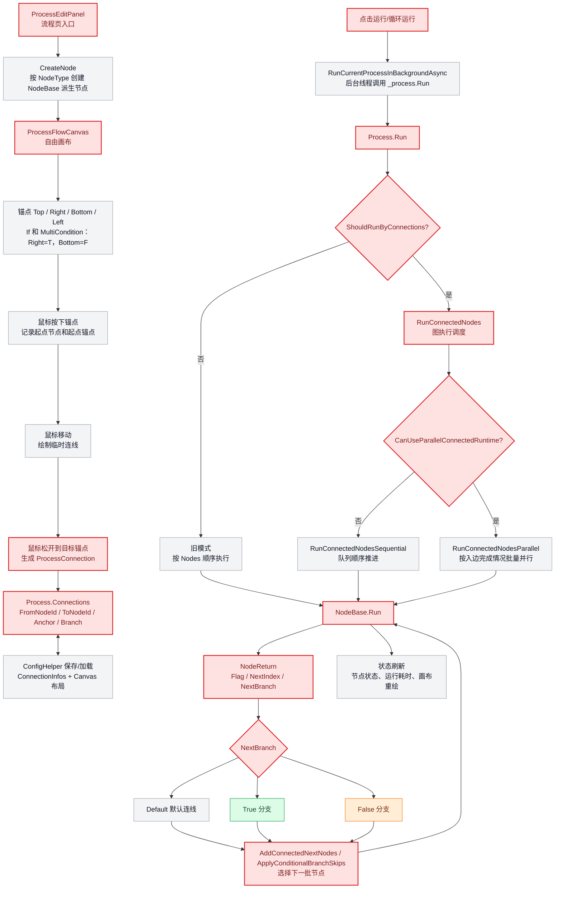

# 流程图连线逻辑与执行架构说明

## 核心结论

当前流程图架构是：画布负责创建、显示、选择和删除连线；流程执行不依赖连线坐标，而是依赖 `Process.Connections` 中保存的有向边表。节点运行后通过 `NodeReturn` 返回继续、停止、跳转或 True/False 分支，`Process` 再根据边表决定下一批节点。

## 红色架构图



## 连线创建逻辑

1. `ProcessFlowCanvas` 在节点周围绘制四个锚点：`Top`、`Right`、`Bottom`、`Left`。
2. 鼠标左键按下锚点时，记录 `_connectionStartNode` 和 `_connectionStartAnchor`。
3. 鼠标移动时，只绘制临时连线，不改变流程数据。
4. 鼠标左键松开到另一个节点锚点时，创建 `ProcessConnection`。
5. 创建前会按“起点节点 + 终点节点 + 分支类型”去重，避免重复连线。
6. 条件节点的分支语义由起点锚点决定：
   - `Right` 表示 True 分支。
   - `Bottom` 表示 False 分支。
   - 其他锚点表示 Default 默认分支。

## 连线数据结构

`ProcessConnection` 是运行时真正使用的边数据：

```csharp
public class ProcessConnection
{
    public string ID { get; set; }
    public int FromNodeId { get; set; }
    public int ToNodeId { get; set; }
    public string FromAnchor { get; set; }
    public string ToAnchor { get; set; }
    public ProcessConnectionBranch Branch { get; set; }
}
```

`Branch` 当前支持三种：

```csharp
public enum ProcessConnectionBranch
{
    Default,
    True,
    False
}
```

## 执行架构

1. `ProcessEditPanel` 点击运行后，通过 `RunCurrentProcessInBackgroundAsync` 在后台线程调用 `_process.Run(...)`，避免阻塞流程图交互。
2. `Process.Run` 先判断 `ShouldRunByConnections()`：
   - 如果存在连线或起始节点，则走图执行。
   - 如果没有图结构，则兼容旧逻辑，按 `Process.Nodes` 顺序执行。
3. 图执行入口是 `RunConnectedNodes(...)`。
4. `CanUseParallelConnectedRuntime()` 返回 true 时，使用并行图调度；否则使用顺序图调度。
5. 每个节点执行 `NodeBase.Run(...)` 后返回 `NodeReturn`。
6. 调度器根据 `NodeReturn.Flag`、`NextIndex`、`NextBranch` 决定是否继续、停止、跳转或走 True/False 分支。

## 顺序图执行

`RunConnectedNodesSequential` 使用待执行队列推进：

1. 从 `GetConnectionStartNodes()` 找起始节点。
2. 取出队列头节点执行。
3. 如果节点失败，记录失败节点并跳过受影响下游。
4. 如果节点返回 `StopRun`，结束整个流程。
5. 如果节点返回 `StopBranch`，只停止当前分支。
6. 如果节点返回 `NextIndex`，兼容旧 If/Else 索引跳转。
7. 否则调用 `AddConnectedNextNodes(...)` 按分支加入下游节点。

## 并行图执行

`RunConnectedNodesParallel` 按图依赖批量执行：

1. 找到当前连通组件。
2. 调用 `GetReadyComponentNodes(...)` 找所有入边已完成、订阅依赖已完成的节点。
3. 调用 `BuildReadyExecutionBatch(...)` 生成本轮可并发运行批次。
4. 批次内节点通过 `Task.WhenAll(...)` 并行执行。
5. 条件节点执行后调用 `ApplyConditionalBranchSkips(...)` 标记未命中的分支。
6. 失败节点会通过下游标记逻辑阻断非容错节点。

## 条件分支节点

`If` 和 `MultiCondition` 是当前图分支的核心节点：

1. 节点运行后计算条件结果。
2. 返回 `NodeReturn(NodeRunFlag.ContinueRun, ProcessConnectionBranch.True/False)`。
3. 调度器只放行匹配分支的连线。
4. `MultiCondition` 还支持 Default 默认路径，True/False 分支判断后默认路径也可以继续执行。

## 保存与加载

保存方案时，`ConfigHelper` 会把每个流程的节点布局和连线写入配置：

1. 节点保存 `CanvasX`、`CanvasY`、`CanvasWidth`、`CanvasHeight`、`IsStartNode`。
2. 连线保存到 `ConnectionInfos`。
3. 加载时 `ProcessEditPanel.RestoreProcessConnections(...)` 还原到 `_process.Connections`。
4. 如果旧配置没有画布图结构，会通过 `CreateLegacyOrderedConnections()` 按节点顺序生成兼容连线。

## 关键源码位置

- `Forms/ProcessNew/ProcessEditPanel.cs`：流程页入口、节点创建、流程加载、运行按钮入口。
- `Forms/ProcessNew/ProcessFlowCanvas.cs`：画布交互、锚点、拖线、连线绘制、连线选择删除。
- `Process.cs`：流程数据、连线边表、顺序/并行图调度、分支推进。
- `Node/INode.cs`：`NodeReturn`、`NodeRunFlag`、节点运行结果协议。
- `Node/6-LogicTool/If/NodeIf.cs`：If 分支返回 True/False。
- `Node/6-LogicTool/MultiCondition/NodeMultiCondition.cs`：多条件分支返回 True/False。

